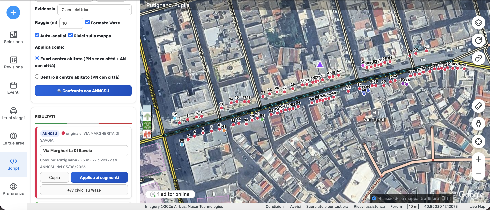
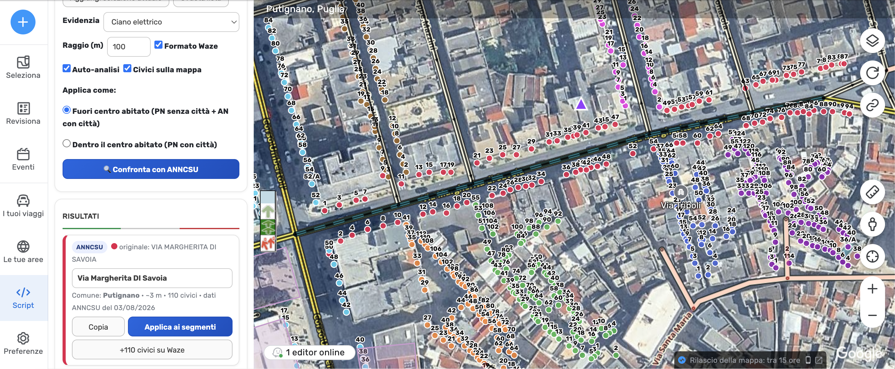

# WME Fonti Stradali IT

Userscript per il **Waze Map Editor** che confronta i segmenti selezionati con i civici e gli odonimi
ufficiali **ANNCSU** (Archivio Nazionale dei Numeri Civici e delle Strade Urbane – Istat / Agenzia
delle Entrate): evidenzia i segmenti in lista, mostra i civici sulla mappa, compila nome via/contrada,
località, comune e inserisce i numeri civici (esponente compreso, es. `343/A`).

Creato da **checcoconf** · dati: ANNCSU, open data con licenza [CC-BY 4.0](https://creativecommons.org/licenses/by/4.0/deed.it).

> **Lo script non sostituisce il lavoro dell'editor: lo facilita.** Ogni modifica va verificata con i
> cartelli stradali, i civici reali, la conoscenza del territorio e buon senso. Lo strumento propone,
> la responsabilità di ciò che finisce sulla mappa resta di chi salva.

---

## Indice

- [Installazione](#installazione)
- [Accessi e abilitazione](#accessi-e-abilitazione)
- [Flusso di lavoro in breve](#flusso-di-lavoro-in-breve)
- [1 · Dati ANNCSU](#1--dati-anncsu)
- [2 · Segmenti (cattura)](#2--segmenti-cattura)
- [3 · Il Raggio: la variabile più importante](#3--il-raggio-la-variabile-più-importante)
- [4 · Confronta con ANNCSU (risultati)](#4--confronta-con-anncsu-risultati)
- [5 · Applica i nomi ai segmenti](#5--applica-i-nomi-ai-segmenti)
- [6 · Inserimento dei numeri civici](#6--inserimento-dei-numeri-civici)
- [Come funzionano gli accessi ANNCSU](#come-funzionano-gli-accessi-anncsu)
- [Errori e cosa fare](#errori-e-cosa-fare)
- [Registro delle modifiche](#registro-delle-modifiche)
- [Note per gli editor](#note-per-gli-editor)
- [Sviluppo e rilasci](#sviluppo-e-rilasci)
- [Licenza](#licenza)

---

## Installazione

1. Installa [Tampermonkey](https://www.tampermonkey.net/).
2. Clicca qui: **[Installa / Aggiorna lo script](https://github.com/checcoconf/wme-fonti-stradali-it/releases/latest/download/wme-fonti-stradali-it.user.js)**
3. Ricarica il Waze Map Editor: il pannello compare nella scheda **Script** della barra laterale.

Gli aggiornamenti arrivano da soli: Tampermonkey controlla l'ultima release pubblicata. In caso di
dubbio: *Tampermonkey → Utility → Controlla aggiornamenti degli userscript*.

**Requisiti**

| Requisito | Dettaglio |
|---|---|
| Editor | `waze.com/editor` o `beta.waze.com/editor` (SDK WME) |
| Gestore userscript | Tampermonkey (serve `GM_xmlhttpRequest` per scaricare i dataset) |
| Spazio locale | IndexedDB: circa **16 byte per civico**, una regione grande occupa poche decine di MB |
| Abilitazione | l'utente Waze deve essere nell'elenco degli abilitati (vedi sotto) |

---

## Accessi e abilitazione

Lo script è **riservato agli editor abilitati**. La verifica avviene all'avvio, prima che venga
attivata qualunque funzione: finché non arriva l'OK non si cattura nulla, non si scaricano dati e non
si disegna niente sulla mappa.

**Come funziona il controllo**

1. Alla partenza lo script legge il tuo **nome utente Waze** (dall'SDK, in mancanza dal modello legacy).
2. Interroga il foglio Google degli abilitati tramite un Web App Apps Script, inviando nome utente,
   livello, id e un identificativo di sessione.
3. Se sei in elenco, il pannello si apre e tutte le funzioni si attivano.
4. Se non lo sei, il pannello mostra **401 Unauthorized** con il tuo nome utente e il motivo, più il
   bottone **"Ho ricevuto l'abilitazione: ricontrolla"** per rifare la verifica al volo.

**Tempi e casi limite**

| Situazione | Comportamento |
|---|---|
| Esito positivo | resta valido **2 ore** in cache locale, poi si richiede di nuovo |
| Editor aperto a lungo | ricontrollo automatico ogni **30 minuti** |
| Abilitazione revocata mentre lavori | chiusura immediata: lista svuotata, civici rimossi dalla mappa, pannello 401 |
| Foglio non raggiungibile | se poco prima eri abilitato si continua per un massimo di **72 ore** di tolleranza; in caso di dubbio non si apre |
| Versione minima imposta dallo sviluppatore | se la tua è più vecchia il pannello mostra **"Aggiornamento necessario"** e blocca tutto finché non aggiorni |

**Per farti abilitare** scrivi ai coordinatori della community italiana di Waze oppure all'autore su
Slack (`@checcoconf`). Il link diretto è nel pannello, in fondo e nella schermata 401.

---

## Flusso di lavoro in breve

1. **Scarica la tua regione** (una volta sola): i civici ANNCSU restano in cache locale.
2. **Imposta il Raggio** in base al contesto (paese ~10 m, fuori centro abitato 20–30 m).
3. **ALT + clic** sui segmenti: si evidenziano sulla mappa ed entrano in lista.
4. **Confronta con ANNCSU**: per ogni odonimo vedi comune, località, distanza e i civici colorati.
5. Correggi il nome nella casella se serve, **Applica ai segmenti** e **salva**.
6. **+N civici su Waze**: elenco di controllo con spunte, poi **Inserisci** e salva di nuovo.

---

## 1 · Dati ANNCSU

Sezione **Dati ANNCSU** del pannello.

| Comando | Cosa fa |
|---|---|
| **Scarica regione** | scarica il dataset ANNCSU della regione scelta, lo analizza e lo salva in locale (IndexedDB) |
| **Scarica tutte** | scorre tutte e 20 le regioni una dopo l'altra (alcuni minuti e parecchia memoria: te lo chiede prima di partire) |
| **Aggiorna** | riscarica solo le regioni che hai già in locale |
| **Svuota dati** | cancella tutte le regioni salvate e riparte da zero |

Durante uno scarico multiplo il bottone diventa **Ferma**: il ciclo si interrompe alla fine della
regione in corso, senza lasciare dati a metà.

**Freschezza dei dati.** ANNCSU aggiorna i dataset regionali con **cadenza mensile**, e in questo
periodo i Comuni stanno completando la georeferenziazione dei civici: un giro ogni **4–6 settimane**
può far comparire strade e numeri prima assenti. Il pannello scrive sempre da quanti giorni hai
scaricato ogni regione e, superati i **35 giorni**, il bottone *Aggiorna* si accende di verde. È solo
un promemoria: **lo script non riscarica mai da solo**.

**Controlli automatici sulla qualità.** Al termine dell'analisi lo script verifica la colonna
`ESPONENTE`: se più della metà dei civici risulta averne uno, quasi certamente si sta leggendo la
colonna sbagliata (un progressivo, un codice interno) e il pannello ti avvisa in arancione. Stesso
avviso se la cache proviene da una versione precedente dello script, nel qual caso gli esponenti
possono mancare: basta ripremere *Scarica regione* per rigenerarla.

**Elenco comuni.** I codici Belfiore vengono tradotti in nomi di comune usando l'elenco ISTAT
incorporato nello script, quindi funziona anche offline.

---

## 2 · Segmenti (cattura)

### Modalità di cattura

Menu **Cattura**:

| Modalità | Come si usa |
|---|---|
| **⌥ ALT + clic** *(predefinita)* | tieni ALT e clicca il segmento |
| **⌥⇧ ALT + MAIUSC + clic** | alternativa se ALT ti serve per altro |
| **⌃/⌘⌥ CTRL + ALT + clic** | idem, su combinazione ancora più libera |
| **⌨ Un tasto a tua scelta + clic** | vedi sotto |
| **Sempre** | ogni clic su un segmento lo mette in lista |
| **Spenta** | nessuna cattura al clic: si usa solo *Aggiungi selezione attuale* |

MAIUSC e CTRL **da soli** non sono selezionabili di proposito: il WME li usa per la multi-selezione.
Se l'SDK lo consente, la scorciatoia **A + C** cicla al volo fra le modalità.

**Tasto personalizzato.** Scegli *Un tasto a tua scelta*: compare un riquadro rosso "cliccami per
attivare l'ascolto del tasto". Cliccalo e premi **un solo tasto**; il tasto letto resta in attesa di
conferma (**Conferma** salva, **Rifai** riapre l'ascolto, **ESC** annulla, **Azzera** torna ad ALT).
Resta salvato anche nelle sessioni successive. Mentre lo tieni premuto lo script blocca l'eventuale
scorciatoia WME sullo stesso tasto, ma conviene comunque sceglierne uno poco usato: i tasti singoli
sono la fascia che WME, Toolbox e gli altri script si contendono.

### La lista dei segmenti

I segmenti catturati compaiono come **chip** sotto il menu:

- clic sul chip → lo seleziona nell'editor;
- clic sulla **×** (o ri-clic sul segmento con il modificatore) → lo toglie dalla lista;
- **chip rosso** → su quel segmento l'ultimo *Applica* è fallito;
- **Aggiungi selezione attuale** → porta in lista ciò che hai già selezionato nel WME;
- **Svuota lista** → azzera tutto (risultati e civici sulla mappa si riallineano da soli).

### Le altre opzioni

| Opzione | Cosa fa |
|---|---|
| **Evidenzia** | colore del tratteggio con cui i segmenti in lista vengono marcati sulla mappa (ciano, fucsia, giallo, lime, arancione) |
| **Raggio (m)** | distanza massima civico–segmento per il confronto → [sezione dedicata](#3--il-raggio-la-variabile-più-importante) |
| **Formato Waze** | applica il maiuscolo/minuscolo delle linee guida italiane (`VIA MARGHERITA DI SAVOIA` → `Via Margherita di Savoia`), rispettando numeri romani e preposizioni |
| **Auto-analisi** | il confronto riparte da solo a ogni modifica della lista |
| **Civici sulla mappa** | disegna i punti ANNCSU etichettati col numero (343, 343/A…), colorati per odonimo |
| **Applica come** | regola di scrittura dell'indirizzo → [sezione Applica](#5--applica-i-nomi-ai-segmenti) |

---

## 3 · Il Raggio: la variabile più importante

Il **Raggio** è la distanza massima, in metri, entro cui un civico ANNCSU viene considerato
"appartenente" ai segmenti che hai in lista. È la variabile che determina la corrispondenza fra
numerazione civica e segmento selezionato: **più il valore tende verso lo zero, più l'accuratezza è
precisa**.

### Come funziona tecnicamente

1. Per ogni segmento in lista lo script calcola il rettangolo che lo contiene, allargato del raggio.
2. Cerca in quel rettangolo, tramite una griglia spaziale, tutti i punti ANNCSU della cache.
3. Per ognuno calcola la **distanza reale punto → polilinea** (non dal centro né dai vertici: dalla
   linea del segmento).
4. Scarta tutto ciò che supera il raggio; il resto viene raggruppato per odonimo.
5. Lo stesso civico agganciato da più segmenti della lista (una via spezzata in tronconi, le due
   carreggiate di un viale, una laterale catturata insieme) viene contato **una sola volta**, con la
   distanza minima trovata.

Alla fine restano al massimo **8 odonimi**, ordinati per distanza, ciascuno col proprio colore.

### Valori consigliati

| Contesto | Raggio | Perché |
|---|---|---|
| **Strada di paese / centro abitato** | **~10 m** | i segmenti sono corti e le vie parallele sono vicine: un raggio stretto evita di agganciare i civici della via accanto |
| **Fuori dal centro abitato / contrade** | **~20–30 m** | i segmenti sono molto più lunghi, gli edifici arretrati dalla strada e non tutti i civici sono inseriti dall'ente comunale |
| **Ricognizione iniziale** | 50–100 m | utile solo per capire *quali* odonimi insistono sulla zona, mai per applicare o inserire |

**Due limiti da tenere a mente**

- **Sotto i ~10 m si rischia di perdere civici legittimi.** I punti ANNCSU stanno sugli edifici e
  sugli ingressi, non sull'asse stradale: spesso sono a 5–20 m dalla mezzeria. Un raggio troppo
  stretto taglia fuori numeri veri, soprattutto dove la carreggiata è larga o c'è un marciapiede
  ampio.
- **Oltre i 45 m il raggio non serve all'inserimento.** Waze rifiuta i civici troppo lontani dal
  segmento: quelli oltre **45 m** vengono comunque esclusi dall'elenco di inserimento (te lo scrive).
  Un raggio di 100 m gonfia solo i risultati con roba inutilizzabile.

### ✅ Raggio configurato bene

**Situazione civica in una strada di paese — raggio consigliato: ~10 metri**

Il confronto aggancia **77 civici**, tutti effettivamente appartenenti al segmento su cui si sta
lavorando. La numerazione è leggibile, coerente e pronta da applicare.

### ❌ Raggio configurato male

**Stesso segmento, raggio 100 metri**

Il confronto aggancia **110 civici** allo stesso odonimo e riempie la mappa con i punti di tutte le
vie limitrofe: otto odonimi diversi, numerazioni sovrapposte, impossibile capire quale numero
appartiene a quale strada. Applicare o inserire in queste condizioni significa sporcare la mappa.

> **Regola pratica:** parti stretto e allarga solo se mancano civici che vedi sul territorio. Se la
> lista dei risultati contiene odonimi che non c'entrano nulla con il segmento selezionato, il raggio
> è troppo largo.

---

## 4 · Confronta con ANNCSU (risultati)

Con **Auto-analisi** attiva il confronto parte da solo a ogni cattura; altrimenti premi
**🔍 Confronta con ANNCSU**.

Per ogni odonimo trovato compare una scheda con:

- il **nome originale ANNCSU** (in maiuscolo, come nell'archivio);
- una **casella modificabile** con il nome già formattato secondo le linee guida Waze;
- **Comune**, **Località/contrada**, **distanza minima** dal segmento, **numero di civici distinti** e
  la **data del dataset** ANNCSU da cui provengono;
- il **pallino colorato** che corrisponde ai punti disegnati sulla mappa;
- i bottoni **Copia**, **Applica ai segmenti**, **+N civici su Waze**.

**Il nome si impara.** Se correggi il nome proposto (per esempio da `Strada Contrada Fontanelle` a
`Contrada Fontanelle`) lo script memorizza la regola e precompila così anche le schede successive. Per
questo caso classico c'è pure il link rapido *usa "Contrada…"*.

**Civici ripetuti.** Se lo stesso numero compare su più record ANNCSU distinti, un avviso in testa ai
risultati te lo dice: sono mostrati tutti, ma nell'elenco di inserimento arrivano senza spunta (vedi
[Come funzionano gli accessi ANNCSU](#come-funzionano-gli-accessi-anncsu)).

---

## 5 · Applica i nomi ai segmenti

### Le due modalità

| Modalità | Cosa scrive |
|---|---|
| **Dentro il centro abitato** | Nome primario = via **con** città |
| **Fuori centro abitato** *(regola IT)* | Nome primario = via con città **"Nessuno"** + nome alternativo = via **con** città |

### Cosa fa esattamente *Applica ai segmenti*

- Tocca **solo ciò che differisce**: i segmenti già a posto vengono saltati e conteggiati a parte.
- **Preserva gli alternativi esistenti**: aggiunge senza togliere.
- Se trova alternativi **non conformi** alle impostazioni, li elenca in una finestra di conferma e li
  rimuove **solo se dai l'OK**; altrimenti li lascia dove sono.
- Dopo ogni scrittura **rilegge il segmento** per verificare che il WME abbia registrato davvero: se
  la prima strategia non funziona ne prova un'altra, e se nemmeno quella riesce il segmento finisce
  fra i falliti (niente successi fantasma).
- I segmenti **fuori dall'area caricata** vengono recuperati spostando la mappa uno per uno.
- Alla fine il riepilogo dice quanti modificati, quanti già a posto, quanti alternativi riallineati e
  quanti falliti, con il motivo.

Poi **salva** (Ctrl+S).

---

## 6 · Inserimento dei numeri civici

Il bottone **+N civici su Waze** apre l'**elenco di controllo**: nulla viene scritto sulla mappa
finché non confermi.

**Prerequisiti:** una strada **con nome** e **nessuna modifica pendente** (il WME vieta di aggiungere
civici su segmenti modificati). Se manca qualcosa, lo script te lo dice prima.

### Cosa vedi nell'elenco

| Elemento | Significato |
|---|---|
| **Spunta** | il civico verrà inserito |
| **Numero modificabile** | si normalizza da solo: `18b` → `18/B`, `12 bis` → `12/BIS` |
| **Distanza** | quanto dista il punto ANNCSU dal segmento |
| Riga con bordo **azzurro** | **già su Waze**: esiste un civico con lo stesso numero entro 40 m → spunta tolta |
| Riga con bordo **giallo** | **ripetizione**: lo stesso numero su un altro record ANNCSU → spunta tolta, decidi tu |
| Riga con bordo **rosso** | numero in **forma 20/1** → vedi sotto |
| Riga esclusa | oltre **45 m** dalla strada: Waze la rifiuterebbe, va inserita a mano |

Un clic sulla riga **centra la mappa** su quel civico, così puoi confrontarlo con Street View.

### Numeri in forma `20/1`

Un numero come `2/4` può essere un civico reale, un intervallo scritto male o una colonna del CSV letta
male. La barra sopra la lista permette di decidere una volta per tutte:

| Scelta | Effetto |
|---|---|
| **non inserito** *(predefinito)* | restano visibili ma senza spunta |
| **includi** | trattati come civici normali, già spuntati |
| **escludi** | tolti dalla lista |

La scelta resta salvata fra le sessioni.

### Aggiungere un civico letto su Street View

Con **+ Aggiungi al centro mappa**: centra la mappa sul portone, scrivi il numero e premi. La riga
nasce lì, già spuntata. Se il centro mappa è a più di 45 m dai segmenti in lista lo script te lo
impedisce, perché Waze lo rifiuterebbe.

### Conferma

**Inserisci** scrive tutti i civici spuntati (senza limite di numero), lavorando a piccoli lotti. Se
hai spuntato lo stesso numero in più punti lo script ti avvisa: Waze ne accetta uno solo per via.
Al termine arriva un riepilogo con inseriti, saltati e motivi dei rifiuti. **Poi salva.**

---

## Come funzionano gli accessi ANNCSU

Nell'archivio ANNCSU l'unità di base **non è il civico, è l'accesso**. Ogni riga del file `INDIR_` è un
punto di accesso georiferito (`PROGRESSIVO_ACCESSO`) con odonimo, località, civico, esponente e
coordinate. Capire questo spiega quasi tutte le stranezze che vedi nell'elenco.

**Un civico può avere più accessi.** Portone principale, passo carrabile, ingresso secondario: sono
record distinti dell'archivio con lo **stesso numero**. Lo script li mostra **tutti**, marcati come
ripetizione e senza spunta, indicando anche a quanti metri sta il "gemello":

- pochi metri di distanza → quasi sempre lo stesso accesso rilevato due volte;
- decine di metri → secondo accesso reale, oppure errore d'archivio.

Solo tu, guardando il territorio e Street View, puoi decidere quale posizione è quella giusta:
**Waze accetta un solo punto per numero sulla stessa via**.

**Esistono accessi senza numero.** Sono record validi (l'archivio li usa per ingressi non numerati):
contano nel totale dei civici distinti dell'odonimo, si vedono come puntini sulla mappa, ma non
compaiono nell'elenco di inserimento perché non c'è nessun numero da scrivere. Se due accessi senza
numero cadono nello stesso identico punto, il secondo viene scartato: non aggiungerebbe nulla da
valutare.

**L'esponente arriva dall'archivio, non è inventato.** `343/A` nasce da `CIVICO=343` + `ESPONENTE=A`,
oppure da un campo unico `343/A`. Se la colonna esponente risulta anomala (più di metà dei civici ne ha
uno) lo script lo segnala nel pannello invece di appiccicare un `/n` a ogni numero.

**Un accesso viene agganciato a un odonimo, non a un segmento.** Il raggruppamento è
`comune + odonimo + località`: per questo lo stesso confronto può restituire più schede, e per questo
un raggio troppo largo fa comparire odonimi che con il tuo segmento non c'entrano niente.

---

## Errori e cosa fare

| Messaggio | Cosa significa | Cosa fare |
|---|---|---|
| *segmento bloccato o permessi insufficienti* | il segmento ha un lock sopra il tuo livello | chiedi lo **unlock** alla community, poi riprova |
| *strada senza nome* | i civici esistono solo su strade con nome | dai prima il nome alla strada (puoi catturarla con lo script) |
| *già su Waze* | il civico esiste già lì vicino | niente da fare: non viene reinserito |
| *segmento con modifiche non salvate* | il WME vieta i civici su segmenti modificati | salva con **Ctrl+S**, riapri l'elenco e riconferma |
| *già esistente / duplicate* (in salvataggio) | doppione | elimina il civico in più |
| *lato errato* / *fuori sequenza* | Waze contesta la posizione | ricontrolla i punti; se sono corretti sul territorio usa **Salva → Forza** |
| *troppo lontano dal segmento* | oltre il limite Waze | piazzalo a mano vicino alla strada e trascinalo sul punto reale |
| *fuori dall'area caricata* | segmento non caricato nell'editor | torna sulla zona e ripremi *Applica* |
| *comune non risolvibile via SDK* | il comune non esiste ancora nel modello | impostalo una volta a mano su un segmento vicino |
| *città vuota ("Nessuno") non trovata* | serve per la regola fuori centro abitato | apri o aggiungi in zona un segmento senza città e riprova |
| *Nessun civico ANNCSU entro N m* | raggio troppo stretto o comune non ancora georiferito | allarga il raggio; se resta vuoto, il Comune non ha caricato le coordinate |

---

## Registro delle modifiche

Lo script tiene un registro delle sole operazioni che **cambiano davvero la mappa e vengono salvate**.
Errori, duplicati, "già a posto" e scarichi di dati **non** lasciano traccia: li vedi nel riepilogo a
schermo, non nell'archivio.

Una riga resta *in sospeso* finché non salvi nell'editor: se ricarichi la pagina senza salvare, le
modifiche non esistono più e le loro righe se ne vanno con loro. Se annulli tutto, vengono scartate.

I dati registrati sono quelli già pubblici dell'attività di editing: nome utente WME, livello,
versione dello script, sessione, odonimo, comune, civico, segmento, permalink e coordinate della
modifica.

---

## Note per gli editor

- Lo script modifica **solo ciò che differisce**, salta ciò che è già a posto e lavora a piccoli lotti:
  **rivedi sempre l'elenco modifiche prima di salvare**.
- I dati ANNCSU sono open data **CC-BY 4.0**: riutilizzabili anche su Waze, purché sia citata la fonte.
- Verifica l'ammissibilità della fonte con i coordinatori della community italiana prima di usarlo su
  larga scala.
- In Italia la georeferenziazione dei civici è ancora in corso: l'assenza di un civico in ANNCSU non
  significa che non esista sul territorio.

---

## Sviluppo e rilasci

- Lo script vive in `wme-fonti-stradali-it.user.js` (root del repo).
- Il versionamento è **manuale**: alza la riga `// @version` nello script (es. `0.1.4` → `0.1.5`) e fai
  push su `main`: la CI pubblica la release `v<versione>`. Se fai push senza alzare la versione, non
  viene pubblicato nulla.
- Il file `.meta.js` è generato dalla CI: **non** va committato.
- Le immagini della documentazione stanno in `docs/img/`.

---

## Licenza

MIT — vedi [LICENSE](LICENSE).

Dati: [ANNCSU](https://www.anncsu.gov.it/it/) (Istat / Agenzia delle Entrate), open data con licenza
[CC-BY 4.0](https://creativecommons.org/licenses/by/4.0/deed.it).

💬 Info, idee o problemi? Scrivimi su **Slack**: `@checcoconf` (workspace della community italiana Waze).
